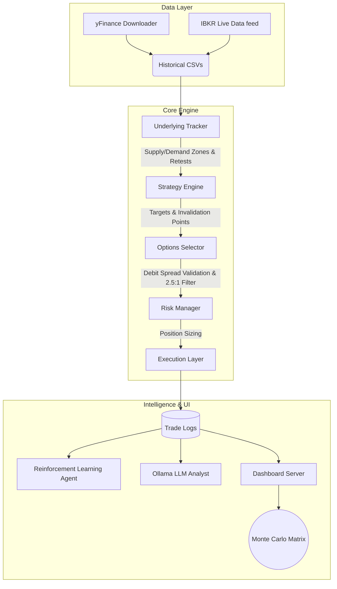

<div align="center">
  <h1>⚡ ApexSpreadator</h1>
  <p><b>A highly disciplined, bidirectional options trading engine driven by Institutional Market Structure and strictly capped Vertical Debit Spreads.</b></p>
</div>

---

## 📖 Overview

**ApexSpreadator** (formerly *TradingGod*) is an automated quantitative options trading framework. It scans the market for high-probability setups using Price Action (Supply & Demand zones) and translates those setups into cheap options spreads.

Unlike typical bots that chase breakouts or buy expensive naked options, ApexSpreadator waits for pullbacks and strictly enforces a **2.5:1 Risk-to-Reward ratio**. It mathematically guarantees that for every $1 risked, the potential payout is at least $2.50.

---

## 🏗️ Architecture & Data Flow

ApexSpreadator is built with a highly modular architecture separating data ingestion, technical analysis, options pricing, and execution.



---

## 🧩 Module Explainers

The codebase is neatly organized into distinct operational domains:

### 1. `core/` (The Trading Engine)
The heart of the trading logic.
- **`underlying_tracker.py`**: Maps out the market structure using fractal windows to identify Institutional Supply (Resistance) and Demand (Support) zones. It watches for price to cleanly retest these zones to generate signals.
- **`options_selector.py`**: The translation layer. It takes a directional stock signal and constructs a **Vertical Debit Spread** (Bull Call or Bear Put) targeting the exact chart profit zones while minimizing premium cost.
- **`strategy.py`**: The orchestrator. It manages the lifecycle of a trade, entering on zone retests and aggressively exiting when chart invalidation points are breached or profit targets are hit.
- **`backtester.py`**: The heavy-duty simulation loop for testing the strategy over years of historical data.
- **`execution.py` & `ibkr_broker.py`**: The live trading interfaces connecting the bot to Interactive Brokers (IBKR) for paper/live trading.

### 2. `tools/` (Analytics & Bootstrapping)
Heavy-lifting scripts for statistical projection.
- **`sector_backtest.py`**: Runs a massive bulk backtest across 100 symbols (10 sectors), running thousands of **Monte Carlo simulations** to project future Expected Value, identifying the assets with the highest mathematical edge.
- **`bootstrap_agent.py`**: Feeds the historical backtest results into the machine learning environment and local LLM to seed the bot's intelligence before live trading.

### 3. `intelligence/` (Self-Learning & AI)
The adaptive brain of the bot.
- **`learning.py`**: A reinforcement layer that tracks the empirical win rate of specific setups (e.g., Demand Zone retests) and dynamically adjusts the confidence thresholds required to take future trades.
- **`ollama_analyst.py`**: Integrates with local LLMs (like `qwen3-coder:30b`) to analyze recent trade history and output human-readable strategic adjustments and performance memos.

### 4. `dashboard/` (The UI/UX)
Premium, glassmorphic web interfaces for monitoring.
- **`serve.py`**: A lightweight local web server to host the static HTML backtest reports.
- **`server.py`**: A FastAPI application utilizing WebSockets to stream live telemetry, open positions, and active supply/demand zones during live execution.
- **`monte_carlo.html`**: A dynamic Bubble Chart matrix pitting Historical Win Rate against Monte Carlo Expected PnL to visually identify Alpha.

---

## 🚀 Setup & Usage

### 1. Prerequisites
- Python 3.10+
- `pip install -r requirements.txt` (Assumes standard data science stack: `pandas`, `numpy`, `fastapi`, `yfinance`)
- Optional: [Ollama](https://ollama.com/) installed locally with the `qwen3-coder:30b` model for AI analysis.

### 2. Running a Standard Backtest
Test the bot on a specific stock over a set timeframe:
```bash
python run_pipeline.py --years 3 --capital 25000 --symbols SPY QQQ
```

### 3. Running the Monte Carlo Matrix
Run a comprehensive bulk simulation across 100 symbols to find the best assets for the strategy:
```bash
python tools/sector_backtest.py
```

### 4. Viewing the Dashboard
Launch the web server to interact with the Backtest Report and Monte Carlo Matrix:
```bash
python dashboard/serve.py
```

---

## 🛡️ Risk Management Philosophy

ApexSpreadator is incredibly defensive:
1. **Vertical Spreads Only**: Buying outright options is banned. The bot only buys debit spreads, instantly neutralizing IV crush and drastically lowering the breakeven point.
2. **Hard-Capped Risk**: Max loss is mathematically guaranteed not to exceed the net debit paid.
3. **2% Rule**: The `PositionManager` actively scales contract sizing so the maximum potential loss on a single setup never exceeds 2% of the total account equity. 
4. **2.5x Reward Minimum**: The algorithm refuses to execute any setup where the theoretical maximum reward is not at least 250% of the risk taken. 

<br>
<div align="center">
  <i>Built for disciplined, systematic edge extraction.</i>
</div>
